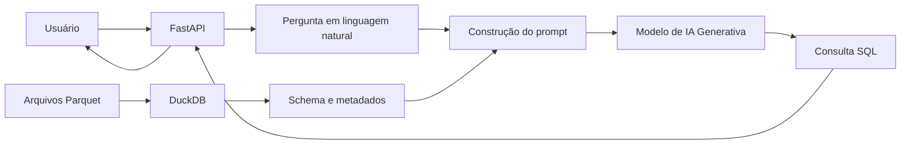

# Natural Language to SQL com IA Generativa

Aplicação desenvolvida em **Python** para converter perguntas escritas em linguagem natural em consultas **SQL**, utilizando **IA Generativa**, metadados das fontes de dados e uma interface web construída com **FastAPI**.

O projeto explora uma abordagem de **Natural Language to SQL (NL2SQL)**, permitindo que perguntas sobre dados sejam transformadas automaticamente em consultas SQL a partir do contexto das tabelas disponíveis.

---

## Sobre o projeto

Consultar bases de dados normalmente exige conhecimento prévio de SQL, estrutura das tabelas, nomes das colunas e tipos de dados.

Este projeto explora o uso de modelos de linguagem para simplificar esse processo.

A aplicação recebe uma pergunta em linguagem natural, identifica o esquema das tabelas disponíveis e fornece essas informações como contexto para um modelo de IA Generativa, responsável por construir a consulta SQL correspondente.

### Exemplo

**Pergunta em linguagem natural:**

```text
Qual foi o valor total faturado por cliente?
```

**Consulta SQL gerada:**

```sql
SELECT
    cliente,
    SUM(valor) AS total_faturado
FROM faturamento
GROUP BY cliente
ORDER BY total_faturado DESC;
```

> O SQL apresentado acima é apenas um exemplo ilustrativo. A consulta efetivamente gerada depende do esquema e dos dados disponíveis.

---

## Problema

A exploração de dados por usuários que não conhecem SQL pode exigir a participação constante de profissionais técnicos para responder perguntas relativamente simples.

Além disso, mesmo usuários com conhecimento em SQL precisam conhecer previamente:

* quais tabelas estão disponíveis;
* quais colunas existem;
* os tipos de dados;
* os relacionamentos e significados dos atributos.

Uma interface baseada em linguagem natural pode funcionar como uma camada intermediária entre a pergunta do usuário e a estrutura técnica dos dados.

---

## Solução proposta

A solução utiliza os metadados das tabelas como contexto para geração automática de SQL.

O fluxo simplificado é:

1. Os dados são disponibilizados em arquivos **Parquet**.
2. O **DuckDB** cria views para consulta desses arquivos.
3. O schema das tabelas é obtido por meio do `information_schema`.
4. A pergunta do usuário é recebida pela aplicação.
5. A estrutura das tabelas é adicionada ao contexto enviado ao modelo de linguagem.
6. O modelo gera uma consulta SQL compatível com os dados disponíveis.
7. A consulta gerada é apresentada ao usuário pela aplicação web.

---

## Arquitetura



A arquitetura foi mantida propositalmente simples, priorizando a demonstração do fluxo **linguagem natural → contexto dos dados → SQL**.

---

## Tecnologias utilizadas

| Tecnologia     | Utilização                                            |
| -------------- | ----------------------------------------------------- |
| **Python**     | Linguagem principal da aplicação                      |
| **FastAPI**    | API e aplicação web                                   |
| **OpenAI API** | Geração das consultas SQL por modelo de linguagem     |
| **DuckDB**     | Consulta aos arquivos Parquet e leitura dos metadados |
| **Parquet**    | Armazenamento dos dados estruturados                  |
| **Pandas**     | Manipulação auxiliar de dados                         |
| **PyArrow**    | Suporte ao formato Parquet                            |
| **Jinja2**     | Renderização da interface web                         |
| **SQL**        | Linguagem de consulta gerada pela aplicação           |

---

## Como funciona

### 1. Carregamento dos dados

Os conjuntos de dados são armazenados em formato Parquet e disponibilizados para consulta pelo DuckDB.

Exemplo:

```python
duckdb.sql(
    "CREATE VIEW FATURAMENTO AS "
    "SELECT * FROM read_parquet('faturamento.parquet')"
)
```

### 2. Extração do schema

A aplicação consulta o catálogo do DuckDB para identificar automaticamente:

* tabelas;
* colunas;
* tipos de dados.

```sql
SELECT
    table_name,
    column_name,
    data_type
FROM information_schema.columns;
```

Essa estrutura é utilizada como contexto para o modelo de linguagem.

### 3. Pergunta em linguagem natural

O usuário pode realizar perguntas como:

```text
Quais clientes possuem os maiores valores a receber?
```

ou:

```text
Qual produto possui a maior quantidade em estoque?
```

### 4. Construção do contexto

A aplicação combina:

```text
Schema das tabelas
        +
Pergunta do usuário
        ↓
Prompt para o modelo
```

Dessa forma, o modelo não recebe apenas a pergunta, mas também informações sobre quais tabelas e colunas estão disponíveis.

### 5. Geração do SQL

O modelo de linguagem interpreta a solicitação e retorna a consulta SQL correspondente.

---

## Estrutura do projeto

A estrutura principal do projeto está organizada da seguinte forma:

```text
natural-language-to-sql/
│
├── dados/
│   ├── faturamento.parquet
│   ├── estoque.parquet
│   └── receber.parquet
│
├── static/
│   └── style.css
│
├── templates/
│   └── index.html
│
├── app.py
├── index.py
├── create_table.py
├── gerar_dados.py
│
├── .env.example
├── .gitignore
├── requirements.txt
├── LICENSE
└── README.md
```

---

## Principais componentes

### `app.py`

Responsável pela aplicação web desenvolvida com FastAPI, incluindo:

* página principal;
* recebimento da pergunta do usuário;
* chamada do módulo de geração de SQL;
* apresentação da consulta gerada.

### `index.py`

Contém a lógica principal do projeto:

* criação das views no DuckDB;
* leitura do schema das tabelas;
* construção do contexto;
* integração com o modelo de linguagem;
* geração das consultas SQL.

### `create_table.py`

Utilitário opcional que demonstra a extração de dados de uma fonte PostgreSQL e sua persistência em formato Parquet. A execução da aplicação principal não depende de uma conexão com PostgreSQL.

### `gerar_dados.py`

Responsável pela criação dos conjuntos de dados sintéticos utilizados na versão pública do projeto.

---

## Dados

A versão de portfólio utiliza **dados fictícios e sintéticos**, criados exclusivamente para demonstração da solução.

Os dados simulam três contextos de negócio:

### Faturamento

Informações relacionadas às vendas e ao faturamento.

### Estoque

Informações sobre produtos e quantidades disponíveis.

### Contas a receber

Informações relacionadas aos valores pendentes de recebimento.

Nenhum dado operacional, pessoal ou confidencial é necessário para execução do projeto.

---

## Como executar

### 1. Clone o repositório

```bash
git clone https://github.com/anamariaalvess/natural-language-to-sql.git
```

```bash
cd natural-language-to-sql
```

### 2. Crie um ambiente virtual

No Windows:

```bash
python -m venv .venv
```

```bash
.venv\Scripts\activate
```

No Linux/macOS:

```bash
python3 -m venv .venv
source .venv/bin/activate
```

### 3. Instale as dependências

```bash
pip install -r requirements.txt
```

### 4. Configure as variáveis de ambiente

Crie um arquivo `.env` a partir do exemplo:

```bash
cp .env.example .env
```

Configure sua chave da API:

```env
OPENAI_API_KEY=sua_chave_aqui
```

> O arquivo `.env` não deve ser versionado no GitHub.

### 5. Gere os dados fictícios

```bash
python gerar_dados.py
```

### 6. Execute a aplicação

```bash
uvicorn app:app --reload
```

Depois, acesse:

```text
http://127.0.0.1:8000
```

---

## Demonstração

A interface permite inserir uma pergunta em linguagem natural e visualizar a consulta SQL correspondente.

Exemplo:

```text
Pergunta:
Qual é o valor total faturado por cliente?

                ↓

        Modelo de linguagem

                ↓

SQL:
SELECT cliente, SUM(valor)
FROM faturamento
GROUP BY cliente;
```

## Demonstração

A aplicação foi projetada para receber perguntas em linguagem natural e gerar consultas SQL a partir do schema das fontes de dados disponíveis.

### Exemplo ilustrativo

**Pergunta:**

```text
Qual cliente possui o maior valor em aberto?

---

## Habilidades demonstradas

Este projeto envolve conceitos e ferramentas relacionados a diferentes etapas de uma solução de dados:

### Ciência de Dados e IA

* IA Generativa;
* Large Language Models (LLMs);
* Natural Language to SQL;
* construção de prompts;
* utilização de contexto estruturado para LLMs.

### Dados

* SQL;
* modelagem e compreensão de schemas;
* metadados;
* arquivos Parquet;
* DuckDB;
* manipulação de dados estruturados.

### Desenvolvimento

* Python;
* FastAPI;
* APIs;
* aplicações web;
* integração com serviços externos;
* variáveis de ambiente;
* organização e documentação de projetos.

---

## Limitações

Modelos de linguagem são probabilísticos e podem gerar consultas incorretas ou incompatíveis com a intenção do usuário.

Por isso, em aplicações reais, algumas medidas adicionais são recomendadas, como:

* validação automática do SQL antes da execução;
* restrição das operações permitidas;
* utilização de usuários de banco somente leitura;
* tratamento de consultas inválidas;
* controle de acesso;
* monitoramento das consultas geradas;
* avaliação sistemática da qualidade das respostas.

Neste projeto, o foco está na demonstração do fluxo de geração de SQL a partir de linguagem natural.

---

## Possíveis evoluções

Algumas melhorias que poderiam ser incorporadas futuramente incluem:

* validação automática das consultas geradas;
* execução opcional do SQL;
* apresentação dos resultados em tabelas e gráficos;
* histórico de perguntas;
* avaliação da qualidade das consultas;
* suporte a diferentes bancos de dados;
* comparação entre diferentes modelos de linguagem;
* tratamento de schemas maiores e mais complexos.

Essas funcionalidades não fazem parte do escopo atual, que busca manter uma implementação simples e didática do problema de **Natural Language to SQL**.

---

## Objetivo do projeto

Este projeto foi desenvolvido com finalidade de estudo e portfólio, demonstrando a aplicação de **IA Generativa integrada a tecnologias de dados** para transformar perguntas de negócio em consultas estruturadas.

O principal objetivo é explorar como modelos de linguagem podem utilizar informações sobre o schema de uma base de dados para auxiliar na construção de consultas SQL.

---

## Autora

**Ana Maria Alves**

Cientista de Dados

[GitHub](https://github.com/anamariaalvess)

---

## Licença

Este projeto está disponibilizado para fins educacionais e de demonstração.
